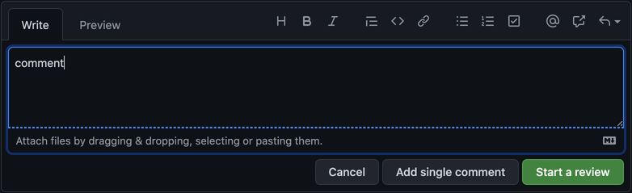
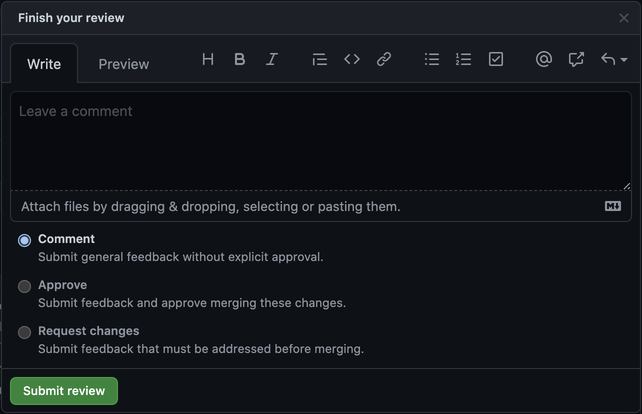

# Commits and Pull Requests

This guide details how git commits and pull requests should be written;
combined, they lead to a well-maintained revision history within the
codebase.

## Writing commits

OGP follows [conventional commits](https://www.conventionalcommits.org/)
to write consistent commit messages. This allows the commit history to
be easily understood, particularly when using `git log --oneline`:

```
$ git log --oneline -n 6
b0ef8790 (origin/develop, origin/HEAD) refactor(sgid): use httpOnly cookies, inject sgid config directly
876fe7a9 fix(sgid): rework codebase in-line with review
db1e4857 feat(sgid): guard with beta flag, reword text
cf12c150 test(sgid): provide test coverage
34a9b6fa feat(auth): enable sgID
86f709f8 feat: Set SP/CP JWT cookie to HttpOnly (#2193)
```

This also allows us to automatically generate CHANGELOGs, and consider
further automation of releases in future.

Contributors who are unfamiliar with conventional commits may invoke
[commitizen](http://commitizen.github.io/cz-cli/) via `npx cz` or
`npx git-cz`, or `npm run cz` on the OGP Application Template. This
provides a series of prompts to write the commit message

[How to Write a Git Commit](https://chris.beams.io/posts/git-commit/)
by Chris Beams is recommended reading; it describes how to write 
comprehensive git commit messages that contribute to a healthy revision
history, allowing someone to understand the motivations and nature of
changes in the codebase easily.


## Opening Pull Requests

### PR Description

Pull Requests (PR) are the mechanism through which changes to projects gets reviewed by team members for approval before being incorporated in the codebase.

Writing a good PR description is a critical aspect of software change and historical tracking.

PRs should give all the context a reviewer needs to understand:
- why the PR exists
- the approach taken to solve the issue

The PR description should be generous in the information it provides to help reviewers.
- link to an RFC where other approaches were discussed
- link to compliance policies
- link to issue in github (ideally all PRs relate, either in part or in full, to an issue)
- link to documentation of esoteric API calls being used
- link to accademic paper for 

Even when reviewers are expected to be from the team, and therefore be familiar with context at that point in time, the PR description should stand on its own from an informational perspective. Doing so ensures:
- The PR is understandable by other reviewers (e.g. new joiners, other team members)
- The context will be understandable by your future self (do not underestimate the mind's ability to forget details!)
- The PR description can be used in other processes (e.g. risk assessment for deployments, audits, incident response)

To faciliate writing consistent PRs descriptions, all repositories should have an up to date [PR template](https://docs.github.com/es/communities/using-templates-to-encourage-useful-issues-and-pull-requests/creating-a-pull-request-template-for-your-repository). PRs should have the following sections:
- Problem
- Solution
- Tests
- Risks

The Risk section is one of the most important part of the PR. The PR author indicates therein he/she has done the required thinking of what could go wrong (best case - worst case) when the code is live, how errors might cascade through the system, and how likely it really is to happen. Risk is a subjective assessment, and obviously, no one opens PRs thinking things are likely to break. Still, all changes carry risk, and engineers are notoriously bad at evaluating risks. The risk section is a reminder for the PR author to think about risks. It also helps reviewers validate the thinking, and comment with their own evaluation if necessary.

Risks typically is a combination of 2 factors:
- **Impact**: what is changed, how many systems or sub systems can thus potentially be affected? Are these system critical? 
  - e.g. "change to the login system": `High`; vs. "change" css font styles on the 'About the team' page: `Low`
- **Likelihood**: does the change concern area with high fluctuations of input or behaviour?

Finally, do follow this guidelines:
  - [Closing issues via Pull Requests](https://help.github.com/en/articles/closing-issues-using-keywords)
  - [Referencing commits, issues and other repos](https://help.github.com/en/articles/autolinked-references-and-urls)
  - [Referencing repository code](https://help.github.com/en/articles/creating-a-permanent-link-to-a-code-snippet)
  - [GitHub Flavored Markdown](https://guides.github.com/features/mastering-markdown/#GitHub-flavored-markdown)
  - [Marking duplicates](https://help.github.com/en/articles/about-duplicate-issues-and-pull-requests)


### Tests and Code Coverage

All PRs should include tests. If no tests are present on purpose, the PR description should indicate why none were needed.

Repositories should ideally have explicit code coverage targets, and a policy that no PR reduces coverage. It is recommended that the coverage level be an automatically assessed criteria for a PR to be mergeable (i.e. PRs which cause coverage to drop are blocked).

OGP recommends repos use [coveralls](https://coveralls.io/) which integrates well with OGP's adopted test tool [jest](https://jestjs.io/).

### Draft PRs

Once a PR is opened, it is expected to be reviewed in a timely manner. Engineers should proactively check the repositories their teams own, and contribute PR reviews before starting entirely new work. Teams should set aggressive targets for PR review timeliness. Ideally a PR author should receive the first feedback to a PR within 1 business day.

Because reviews can take a considerable amount of time, and because engineers are notified when PRs are opened, PR authors should be considerate when opening PRs. PRs should only be opened when they really are ready for review. In practice, this mean:
- PR Description is complete
- Changeset is complete
- Tests are present
- Functional tests have been performed locally

It is however sometimes needed to get feedback early. For these cases, PRs may be opened in an incomplete state, provided they meet the following requirements:
1. They are opened as [Draft PRs](https://github.blog/2019-02-14-introducing-draft-pull-requests/)
2. The PR title includes a leading string `[WIP] ` in the PR title (WIP stands for "Work In Progress")
3. [Optional] Add a label `wip`

Draft PRs are not expected to receive proactive reviews from engineers. Instead the PR author may seek feedback from specific folks as needed.

When the PR is ready for review, the PR author must transition it to **Ready for Review**, and remove the leading `[WIP]` string from the PR title.

### Closing PRs

All PRs at OGP require (at least) 1 approval to be merged.

Teams should strive to close PRs in a timely manner. Considering that having many opened PR causes context switching overheads to engineers, teams should ideally have an SLA policy for review time and merging.

PR authors are ultimately responsible for merging their PRs. If a PR is not getting attention from the team, it is up to the PR author to ask for reviews and approvals.

It is recommended that all repositories adopt a "Stale-PR" policy. PRs which see no activity and are not getting merged should be closed automatically.

If priorities shift, and a PR cannot get the reviews it requires, the PR author is encouraged to close the PR proactively, and re-open it later, when the team has bandwidth to tend to the work.


## PR Reviews

All engineers are required to review PRs as part of their duties. 

### Purpose

PR reviews foster discussions on implementation details, algorithms, feature sets, edge cases, etc. They are an excellent avenue for learning for everyone involved and, can help surface potential issues. Review comments typically touch on subjects such as:
- Giving feedback on code concepts such as abstractions, encapsulation, testability, security, etc.
- Gaining concensus on code structure
- Suggesting alternative APIs or libraries
- Identifying edge cases

Code is read much more than it is written. PR reviews ensure that changes are legible by multiple people early, before they are integrated into the code base.

### Manners

PR reviews are done over comment threads in github. As asynchronous discussions, PR comment threads can cause anxiety for both PR authors and reviewers when disagrements surface.

All participants in PR reviews should maintain a level head, and abide by some simple rules of etiquette:
- Assume good intent
- Always be respectful, polite, and pleasant
- Favour questions over statements
- Don't jump to conclusions / criticism
- Be generous in your explanations and background details when proposing alternatives

### Content

Where possible, when a reviewer has an suggestion for an alternative implementation, he/she should provide some sample code to explain the different approach (use github's [code suggestion](https://docs.github.com/en/github/collaborating-with-pull-requests/reviewing-changes-in-pull-requests/commenting-on-a-pull-request#adding-line-comments-to-a-pull-request) feature for that)

Discussions in PRs on code style are typically not productive and are discouraged. To make this a non-issue, repositories should adopt opinionated code formatters, which will help to ensure a consistent coding style across repos, and eliminate discussions on syntax and style. At OGP, [prettier](https://prettier.io/) has been adopted as the organisation-wide formatter. All repos should use it, and teams are strongly encouraged to set up formatter pre-commit hooks with [husky](https://typicode.github.io/husky/).

### WorkFlow

PR authors are notified of comments as they happen, and this is noisy when a slow trickle of comments is submitted. To prevent that, reviewers should submit all of their comments in one go by using github's review mechanism. This helps reviewers themselves, since a comment or question they had early on may answer itself as they progress through the PR review.



When submitting a review, github classification should be use with care by reviewers, as follows:
- `Comment`: You have questions or comments and are thus so far non-committal. Should someone else approve the PR, you would be generally OK with the PR being merged as-is
- `Approve`: You agree with the changeset in the PR, and stand by it as if you had written the code yourself
- `Request changes`: You have spotted serious flaws in the PR that must be addressed. PR must not be merged in its current state



The PR author is expected to answer questions and comments in the PR. When a particular PR comment thread is concluded to the satisfaction of all involved, the thread should be marked resolved through the button `Resolve Conversation`.

PR reviews are iterative activities. Every comment thread in the PR may yield a deep discussions where participants go back and forth on a particular issue.

PR comments often yield improvements to the PR, where the PR author modifies the code to incoporate feedback. Once changes have been pushed to the PR, the PR author should notify the reviewer that the PR is ready for another round of review. This can be done with a PR-level comment, where the PR author explicitly mentions the affected reviewers.

To make successive rounds of review easier, PR authors should not force push changes into the PR. Instead, changes should be pushed as new commits, such that when reviewers do their new round of review, they can easily identify what has changed. In fact, a common strategy reviewers adopt is to look at just the new commits first, before looking at the PR overall again.

It is worth noting that when a question is being asked by a reviewer, it is a sign that the code is lacking some level of clarity. While it is possible a simple, straight answer can be given in the comment thread, PR authors should take the question seriously, and consider whether the code itself can be made clearer.

### Pairing reviews

It can be helpful to pair through reviews. A reviewer may ask the PR author for assistance in a live setting. Context can be provided on the spot, changes and improvements can be discussed and implemented immediately.

When authors expect their PR to be particularly complicated for whatever reason, they can schedule a review pairing session with another developer proactively.

### Conflict resolution

While the hope is that consensus and agreement can be reached in PR reviews, deep-seated disagreements sometimes occur. This section provides some strategies to deal with such situations.

- Stay polite and respectful at all time
- Do not reply when flustered
- Consider the position of the other developer carefully to see the merits/flaws of their arguments
- Explain in different wordings or give alternative examples or code samples that illustrate your points better
- Indicate you understand the alternative proposal or system, but you don't agree with it

As asynchronous written discussions, comment threads do not convey tone of voice or body language. When disagreement occurs, It can be immensely helpful to call for a face to face meeting, in person or over zoom, to go over the contentious item live. An agreement can more easily be reached in person.

Disagreement sometimes occur when both parties understand each-other solutions well, but disagree on the tradeoffs that should apply for a particular situation, and that is what driving their divide on the implementation. Such cases should probably be discussed in the broader team, or escalated. The PM or Tech Lead may have to clarify which trade off we wish to pursue as a team.

When a solution is eventually picked, you may still disagree with it, but your commitment to deliver on the decision is expected anyway.

## Merging Pull Requests

PRs at OGP require at least 1 approval in order to be merged.

In case of contributions from open source contributors, or contributions from egineers not members of the team owning the repo, one approval from a member of the owning team should be gathered.

When Merging PRs into the develop branch. Use github's "Squash and merge" strategy, as it makes reverts trivial.
